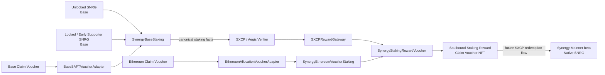

# SNRG Presale Staking Contracts

Public smart-contract repository for the **Synergy Network SNRG presale staking program**.

This repository is published for transparency so community members, integrators, security researchers, and auditors can inspect the staking rules and the cross-chain reward-accounting design directly from source.

> **Status: pre-production / security review.** The contracts in this repository should not be interpreted as audited, production-approved, or deployed solely because the source is public. Production deployment requires final configuration verification, chain-fork testing, independent security review, and approval of the production SXCP/Aegis integration.

## What this system does

The presale staking system supports four economic sources of SNRG:

1. **Unlocked SNRG on Base**
2. **Locked / Early Supporter SNRG on Base**
3. **Base claim-voucher NFT entitlement**
4. **Ethereum claim-voucher NFT entitlement**

Users choose a fixed staking term and receive a fixed one-time reward if the position reaches maturity.

| Staking term | Fixed reward |
|---|---:|
| 3 months / 90 days | 4% |
| 6 months / 180 days | 6% |
| 9 months / 270 days | 8% |
| 12 months / 365 days | 10% |

These percentages are **term-total rewards**, not APR, APY, or compounding rates.

All canonical SNRG reward accounting uses **9-decimal SNRG nwei**.

## Early unstaking

A user may exit an active position before maturity.

Early unstaking is intentionally simple:

- **100% of ERC-20 principal is returned**, or the full virtually-staked NFT entitlement is released;
- there is **no principal penalty**;
- there is **no fee or slashing**;
- there is **no prorated reward**; and
- **100% of the reward for that position is forfeited**.

An early-exited position cannot later receive a staking reward voucher for that position.

After maturity, the user settles the position instead of calling the early-exit path.

## ERC-20 staking vs. voucher staking

The system intentionally handles ERC-20 SNRG and claim-voucher entitlements differently.

### ERC-20 positions

For unlocked and locked SNRG on Base, the staking contract takes custody of the exact ERC-20 principal. The amount received is checked using balance differences so fee-on-transfer behavior cannot silently change the recorded stake amount.

At maturity or early exit, the principal is returned to the position owner.

### Claim-voucher positions

Voucher staking is **virtual**.

The claim NFT remains in the holder's wallet. The staking contract reserves a selected amount of the SNRG entitlement represented by that voucher rather than transferring the NFT.

For example:

```text
Voucher entitlement:       5,000,000 SNRG
3-month position:          1,000,000 SNRG
12-month position:         2,000,000 SNRG
Remaining entitlement:     2,000,000 SNRG
```

Reservations are tracked against the canonical economic allocation so multiple positions cannot collectively reserve more than the entitlement known to the staking contract.

If an underlying claim voucher is consumed before a virtual position can validly settle, the affected staking reward is invalidated rather than allowing the same economic entitlement to be used twice.

---

# Architecture

The design separates **staking**, **chain-specific voucher interpretation**, **cross-chain verification**, and **reward issuance** instead of combining all responsibilities into one large contract.



**SXCP coordinates authenticated facts. It is not used as a token bridge and this design does not require wrapped SNRG.**

Base ERC-20 principal remains on Base while it is staked. Ethereum receives verified reward-accounting facts rather than bridged principal.

---

# Why the system is split into 12 contract components

The staking system is intentionally modular. A single monolithic contract would have to understand Base ERC-20 custody, two different voucher formats, Ethereum reward NFTs, cross-chain verification, accounting, staking terms, and administrative controls all at once.

Separating those responsibilities makes the trust boundaries easier to inspect and allows chain-specific integrations to change without rewriting the economic core.

The architecture is best understood as **12 logical Solidity components**. They are **not 12 independently deployed contracts**.

| # | Component | Type | Runs on | Purpose |
|---:|---|---|---|---|
| 1 | `SynergyBaseStaking` | Core contract | Base | Custodies unlocked/locked Base SNRG, virtually stakes Base voucher entitlement, manages maturity/early exit, and emits canonical Base reward facts. |
| 2 | `BaseSAFTVoucherAdapter` | Adapter | Base | Reads the existing Base claim-voucher format and converts its entitlement into the canonical staking representation. |
| 3 | `SynergyEthereumVoucherStaking` | Core contract | Ethereum | Virtually stakes Ethereum claim-voucher entitlement and registers/cancels/settles Ethereum-origin reward commitments. |
| 4 | `EthereumAllocationVoucherAdapter` | Adapter | Ethereum | Isolates the Ethereum presale voucher ABI from the staking core and normalizes its entitlement data. |
| 5 | `SynergyStakingRewardVoucher` | Reward ledger + ERC-721 | Ethereum | Canonical reward accounting ledger and issuer of soulbound staking reward claim-voucher NFTs. |
| 6 | `SXCPRewardGateway` | Cross-chain application gateway | Ethereum | Accepts Base-originating staking facts only after the configured SXCP verifier authenticates them. |
| 7 | `StakingTerms` | Library | No | Defines the four authorized terms, fixed reward basis points, durations, and reward math. |
| 8 | `RewardTypes` | Library | No | Defines shared staking-source, cancellation, and reward-commitment data used across contracts. |
| 9 | `IEntitlementAdapter` | Interface | No | Common read interface that lets staking contracts consume different claim-voucher implementations through one normalized API. |
| 10 | `IRewardVoucherLedger` | Interface | No | Narrow interface used by staking/gateway contracts to register, cancel, and issue reward commitments. |
| 11 | `ISXCPVerifier` | Interface | No | Security boundary between the application and the production SXCP/Aegis fact verifier. |
| 12 | Source-voucher ABI boundary | Integration interfaces | No | Minimal ABI declarations for the existing Base and Ethereum voucher contracts. These declarations live inside the adapter source files and keep external voucher details out of the staking core. |

### Why the raw file count may look different

The architecture above counts **logical responsibilities**, not only `.sol` filenames.

The current source layout keeps the chain-specific source-voucher ABI declarations directly inside their adapter files. As a result, GitHub or an automated scanner may report a different raw count depending on whether it counts files, deployable contracts, interfaces, or Solidity declarations.

The important distinction is:

- **6 application contracts are deployed by this staking package**;
- **2 shared libraries** hold economic definitions;
- **3 public interfaces** define narrow protocol boundaries; and
- **1 logical source-voucher integration boundary** is implemented by the chain-specific ABI declarations inside the two adapters.

This separation is deliberate—not duplicated staking logic.

---

# Contract details

## `SynergyBaseStaking.sol`

The Base staking contract handles three Base-side staking sources:

- unlocked/live SNRG ERC-20;
- locked / Early Supporter SNRG ERC-20; and
- Base claim-voucher NFT entitlement.

Responsibilities include:

- exact ERC-20 principal custody;
- fixed-term position creation;
- reward snapshotting when the position is opened;
- virtual voucher-entitlement reservation;
- mature settlement;
- penalty-free early exit with complete reward forfeiture;
- invalidation of consumed voucher positions;
- source-side accounting; and
- emission of facts intended for SXCP verification.

The Base contract does **not** mint the Ethereum reward NFT.

## `BaseSAFTVoucherAdapter.sol`

This adapter provides a narrow read-only boundary around the existing Base claim-voucher contract.

It normalizes:

- ownership;
- entitlement amount;
- canonical allocation identity; and
- consumed/claimed state.

Keeping this logic in an adapter means a source-voucher ABI change does not require rewriting the Base staking engine.

## `SynergyEthereumVoucherStaking.sol`

This is the Ethereum-side virtual staking contract for Ethereum presale claim-voucher entitlements.

The NFT remains in the user's wallet. The contract reserves entitlement by economic allocation and records the pending reward directly with the canonical Ethereum reward ledger.

It supports the same fixed terms and early-exit economics as Base staking.

## `EthereumAllocationVoucherAdapter.sol`

This adapter translates the existing Ethereum presale allocation-voucher format into the common `IEntitlementAdapter` representation.

The adapter exists specifically so production verification of the external voucher ABI is isolated from the staking contract itself.

## `SynergyStakingRewardVoucher.sol`

This contract is both:

1. the **canonical Ethereum accounting ledger for presale staking rewards**; and
2. the **soulbound ERC-721 reward claim voucher**.

It tracks the reward lifecycle from pending commitment through issuance, cancellation, and redemption status.

Reward vouchers are intentionally non-transferable so the right created for a staking beneficiary cannot be freely traded as a normal NFT.

The ledger does **not** contain a staking reward pool and does **not** enforce an on-chain reward budget cap.

## `SXCPRewardGateway.sol`

The gateway is the Ethereum application endpoint for Base-originating staking facts.

Anyone may relay an attestation, but the gateway changes reward state only when the configured `ISXCPVerifier` accepts the exact expected fact and scope.

Its responsibilities are deliberately narrow:

- register a Base-origin reward as pending;
- issue a reward voucher after valid mature settlement; and
- cancel a pending reward after an authenticated early exit or invalidation.

It does not bridge SNRG and does not implement the SXCP/Aegis cryptographic verification itself.

## `StakingTerms.sol`

Defines the only supported campaign terms:

```text
90 days  -> 4%
180 days -> 6%
270 days -> 8%
365 days -> 10%
```

Reward calculations use basis points and canonical 9-decimal SNRG nwei.

## `RewardTypes.sol`

Contains the shared typed representation of a staking reward commitment, including:

- source chain;
- source staking contract;
- position ID;
- beneficiary;
- staking source;
- source asset/token ID;
- allocation ID;
- principal;
- reward;
- fixed reward rate; and
- start/maturity timestamps.

This common representation is important because Base-originating facts must mean exactly the same thing when authenticated and consumed on Ethereum.

## `IEntitlementAdapter.sol`

Defines the normalized API used by both chain-specific voucher adapters.

The staking contracts depend on this interface instead of embedding source-voucher implementation details.

## `IRewardVoucherLedger.sol`

Defines the minimal reward-ledger operations used by staking and cross-chain application contracts.

Restricting callers to a narrow interface reduces unnecessary coupling to the ERC-721 implementation.

## `ISXCPVerifier.sol`

Defines the application-facing SXCP verification boundary.

The staking package does not attempt to duplicate SXCP/Aegis verification logic. Production deployment must connect this interface to the approved verifier implementation.

## Source-voucher ABI boundary

The adapters contain minimal interfaces for the already-existing Base and Ethereum voucher contracts.

These are intentionally kept local to the adapters because they describe external contracts rather than new staking state machines.

---

# Reward lifecycle

A successful position follows this economic lifecycle:

```text
POSITION OPENED
      |
      v
PENDING REWARD COMMITMENT
      |
      +-------------------------------+
      |                               |
      | reaches maturity              | early exit / source invalidated
      v                               v
MATURE SETTLEMENT                 REWARD CANCELLED
      |                               |
      v                               +--> no reward NFT
REWARD VOUCHER ISSUED
      |
      v
SOULBOUND ETHEREUM NFT
      |
      v
FUTURE SXCP REDEMPTION
      |
      v
NATIVE SNRG ON SYNERGY MAINNET-BETA
```

A cancellation tombstone is retained so a delayed cross-chain message cannot legitimately resurrect an already-cancelled reward commitment.

---

# Reward accounting

There is **no reward pool inside these contracts** and no contract-level rule such as `totalRewards <= poolBalance`.

Instead, the reward NFT/ledger maintains accounting telemetry for the complete staking-reward lifecycle, including:

- pending rewards;
- issued rewards;
- outstanding reward vouchers;
- redeemed rewards;
- cancelled rewards;
- early-exit forfeitures;
- source-invalidated rewards; and
- lifetime committed rewards.

These values are intended for reconciliation and transparency. They are not a budget-enforcement mechanism.

Base-originating commitments can temporarily differ between Base and Ethereum while an SXCP fact is awaiting finalization/relay. Operational monitoring should treat this as cross-chain synchronization lag rather than silently assuming both totals update in the same transaction.

---

# Security design

The contracts use several defensive patterns intentionally.

### Delayed administrative transfer

Administrative contracts use OpenZeppelin delayed two-step default-admin transfer rules rather than a simple one-transaction ownership handoff.

Production administration should be assigned to the approved Synergy governance/multisig authority rather than a personal EOA.

### Role separation

Operational responsibilities are separated into narrow roles where applicable, including pausing, keeper/invalidation, reward registration, issuance, and metadata administration.

Possessing an operational role does not automatically grant every administrative capability.

### Pausing is not custody lockup

The staking pause is intended to stop **new positions** during an incident.

Mature settlement and early exit are intentionally designed to remain available when new staking is paused.

An underlying ERC-20 can still independently prevent a Base principal transfer if that token contract itself is paused or otherwise rejects transfers. In that case the staking transaction reverts atomically and the position remains active.

### Reentrancy protection and interaction ordering

State-changing paths that cross external-contract boundaries use reentrancy protection and deliberate interaction ordering.

### Exact ERC-20 receipt accounting

ERC-20 staking validates the actual token balance change instead of assuming the requested transfer amount was received.

### Immutable integration dependencies

Critical external integration addresses are supplied at deployment and are not intended to be casually swapped by an administrator after positions have been opened.

### Allocation-level voucher accounting

Voucher reservations use economic allocation identity in addition to token-level data so multiple representations of the same allocation cannot be independently treated as fresh entitlement within the same staking domain.

---

# Trust boundaries and known integration requirements

Publishing the source is intended to make these boundaries explicit.

## External claim-voucher contracts

The adapters read contracts that are outside the staking package. Their production ABI and behavior must be verified against the live deployed contracts before launch.

## Virtual staking cannot lock the original voucher by itself

The existing source vouchers do not expose a generic staking-reservation hook through the interfaces used here. The NFT therefore stays in the owner's wallet.

If the source entitlement is consumed while a virtual staking position is active, the staking system treats that source as invalid and cancels the associated unissued reward rather than paying twice for the same entitlement.

## Cross-domain allocation identity

Base and Ethereum each enforce reservations inside their own staking domain. If the same underlying economic presale allocation can be represented simultaneously on both chains, production launch must ensure the canonical allocation identity and SXCP coordination prevent that allocation from being independently staked on both domains.

This is a cross-chain integration requirement, not something that should be assumed from chain-local NFT token IDs.

## SXCP verifier

`ISXCPVerifier` is an interface boundary. The production SXCP/Aegis verifier implementation and its exact verification rules must be finalized and reviewed before deployment.

## Mainnet-beta redemption

This repository creates and accounts for the Ethereum soulbound staking reward voucher. The final exact-once redemption mechanism that releases native SNRG on Synergy Mainnet-beta depends on the production Mainnet-beta/SXCP interface and is treated as a separate integration boundary.

---

# Repository layout

```text
contracts/
├── adapters/
│   ├── BaseSAFTVoucherAdapter.sol
│   └── EthereumAllocationVoucherAdapter.sol
├── base/
│   └── SynergyBaseStaking.sol
├── common/
│   ├── RewardTypes.sol
│   └── StakingTerms.sol
├── ethereum/
│   ├── SXCPRewardGateway.sol
│   ├── SynergyEthereumVoucherStaking.sol
│   └── SynergyStakingRewardVoucher.sol
└── interfaces/
    ├── IEntitlementAdapter.sol
    ├── IRewardVoucherLedger.sol
    └── ISXCPVerifier.sol

test/
docs/
foundry.toml
remappings.txt
deploy.env.example
```

---

# Building and testing

The project is built with Foundry.

## Requirements

- Foundry (`forge`, `cast`)
- Solidity compiler version configured by `foundry.toml`
- OpenZeppelin Contracts version required by the repository

Install dependencies according to the pinned project configuration, then run:

```bash
forge build
forge test -vvv
```

For deployment or fork testing, copy the example environment file rather than committing secrets:

```bash
cp deploy.env.example .env
```

Never commit private keys, seed phrases, RPC credentials, or privileged API tokens.

---

# Automated security analysis

Automated scanners are useful for identifying suspicious patterns, but scanner scores are **not security proofs**.

This repository is intended to be checked with multiple independent tools, including:

- SolidityScan
- Cyfrin Aderyn
- Trail of Bits Slither
- ConsenSys Mythril
- Ackee Wake

A finding that appears in multiple independent analyzers receives higher review priority. Gas/style findings are evaluated separately from exploitable security findings so secure application logic is not weakened solely to improve a numeric scanner score.

Production deployment should still receive independent human review/audit in addition to automated analysis and Foundry tests.

---

# Deployment transparency

Production deployment addresses should be published here only after they are independently verified.

| Network | Contract | Address |
|---|---|---|
| Base | `BaseSAFTVoucherAdapter` | _TBD_ |
| Base | `SynergyBaseStaking` | _TBD_ |
| Ethereum | `EthereumAllocationVoucherAdapter` | _TBD_ |
| Ethereum | `SynergyStakingRewardVoucher` | _TBD_ |
| Ethereum | `SynergyEthereumVoucherStaking` | _TBD_ |
| Ethereum | `SXCPRewardGateway` | _TBD_ |

After deployment, the repository should also publish the exact source commit used for deployment and links to verified explorer source code.

---

# Pre-production launch gates

Before production value is accepted, the release process should include at least:

- successful deterministic compilation;
- full Foundry test suite;
- Base and Ethereum fork tests against the actual dependency contracts;
- verification of both external voucher ABIs;
- verification of the production SXCP/Aegis verifier integration;
- cross-domain allocation replay/double-stake tests;
- early-exit and maturity boundary tests;
- ERC-20 custody/solvency invariant tests;
- role and multisig configuration review;
- cross-chain ordering/replay tests;
- independent automated scans;
- independent human security review/audit; and
- publication of final deployed addresses and source commit hashes.

---

# Transparency and responsible disclosure

This repository is public so the staking rules and implementation can be independently inspected.

Public source code does **not** mean a contract is risk-free. Smart contracts, cross-chain verification, external token contracts, and deployment configuration can all introduce risk beyond what is visible in a single source file.

If you identify a potentially exploitable vulnerability, please use the project's private security-reporting channel or GitHub private vulnerability reporting when available rather than publishing an active exploit before the maintainers have had a reasonable opportunity to investigate.

---

# Scope of this repository

This repository covers the **presale staking and Ethereum reward-voucher layer**.

It does not attempt to contain every Synergy Network protocol component. In particular, production SXCP/Aegis infrastructure and the final Synergy Mainnet-beta native reward-redemption implementation are separate security domains and must be reviewed as part of the complete end-to-end system.

---

# License

The Solidity source files currently use the `MIT` SPDX identifier. A repository-level `LICENSE` file should be included with the public release so the applicable license is explicit to GitHub users and downstream reviewers.

---

## Summary

The design goal is straightforward:

> **Stake eligible presale SNRG or claim-voucher entitlement for a fixed term, preserve principal on early exit, forfeit the reward on early exit, and represent successfully earned rewards as authenticated soulbound claim vouchers for native SNRG on Synergy Mainnet-beta.**

The multi-contract architecture exists to keep custody, entitlement interpretation, cross-chain verification, and reward issuance independently reviewable rather than hiding all of those responsibilities inside a single monolithic contract.
